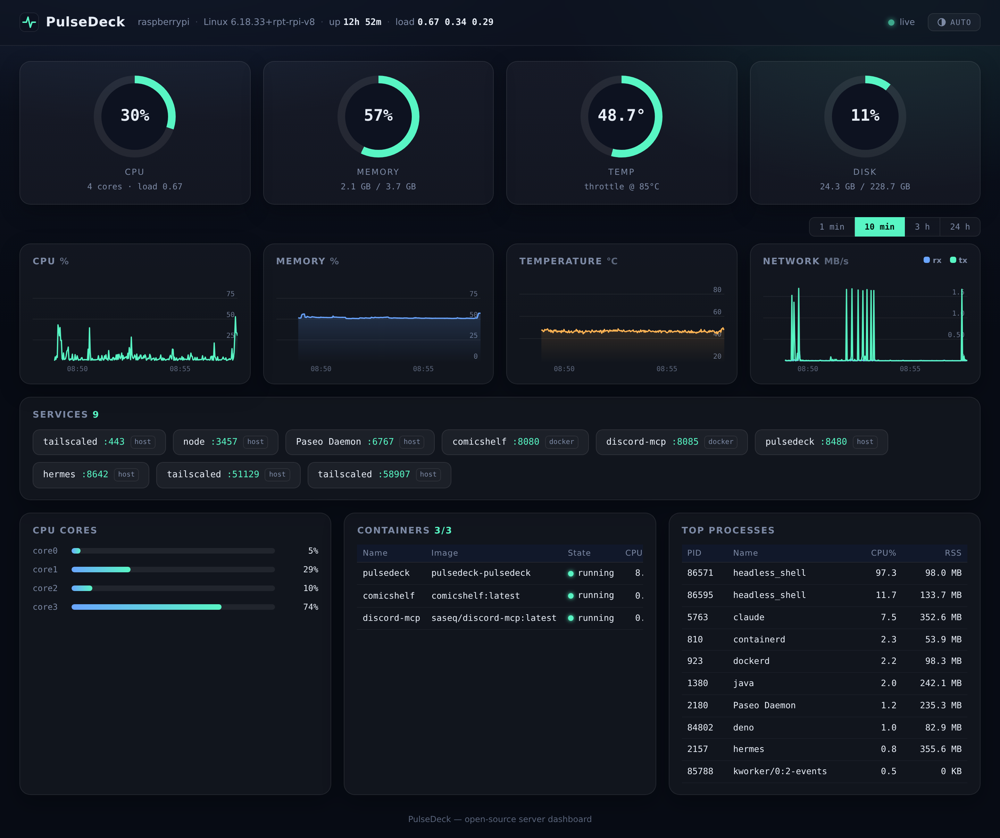

# PulseDeck

A beautiful, zero-dependency server dashboard for Linux — built for Raspberry Pi and small home servers,
designed to be exposed safely over [Tailscale](https://tailscale.com/).




## Features

- **Live metrics via SSE** — CPU, memory, CPU temperature, disk, network throughput, load average, uptime.
  Updates every 2 seconds, no page reloads.
- **10-minute history charts** — rendered with hand-rolled canvas charts (no chart library), with value and
  time axis labels.
- **Services list** — auto-detects listening TCP ports and Docker port mappings, and turns them into clickable
  links. Never forget which port a service lives on again.
- **Docker containers** — state, CPU% and memory per container, straight from the Docker Engine API over the
  unix socket.
- **Top processes** — top 10 by CPU with RSS.
- **Eco mode by design** — when nobody is watching, process scanning, Docker polling and service discovery all
  pause (≈0.2% CPU idle on a Raspberry Pi 4).
- **PWA-ready** — add to your phone's home screen for a full-screen, edge-to-edge experience.
- **Tiny footprint** — a single Deno process, no database, no client-side dependencies. Frontend is plain
  HTML/CSS/JS.

## Quick start (Docker)

```bash
git clone https://github.com/haruka-aisaka/pulsedeck.git
cd pulsedeck
docker compose up -d --build
```

Open `http://<host>:8480`.

The compose file uses:

- `network_mode: host` + `pid: host` — so the dashboard reports **host** network/process metrics rather than
  the container's.
- `cap_add: SYS_PTRACE` — needed only to resolve process names for the services list (reading other processes'
  `/proc/<pid>/fd`). You can remove it; services will then show as `unknown`.
- A read-only mount of the Docker socket — omit it and everything except the containers card still works.

## Expose over Tailscale

On the host (already joined to your tailnet):

```bash
sudo tailscale serve --bg 8480
```

Your dashboard is now available at `https://<hostname>.<tailnet>.ts.net/` with automatic HTTPS, visible only
inside your tailnet. To stop serving: `sudo tailscale serve --https=443 off`.

> **Note** — PulseDeck has no built-in authentication. Only expose it on networks you trust (such as your
> tailnet). Do not forward it to the public internet.

## Run without Docker

Requires [Deno](https://deno.com/) 2.x on Linux:

```bash
deno task start
```

## Configuration

| Env var       | Default                | Description                                  |
| ------------- | ---------------------- | -------------------------------------------- |
| `PORT`        | `8480`                 | HTTP listen port                             |
| `HOST_ROOT`   | `/`                    | Path whose filesystem is shown as disk usage |
| `DOCKER_SOCK` | `/var/run/docker.sock` | Docker Engine API socket                     |

## API

- `GET /api/stream` — SSE stream. Emits a `history` event on connect, then a `snapshot` event every 2 s.
- `GET /api/snapshot` — current snapshot plus history as one JSON document.

## Development

```bash
deno task dev        # watch mode
deno fmt && deno lint && deno check server/main.ts
```

## License

[MIT](LICENSE)
